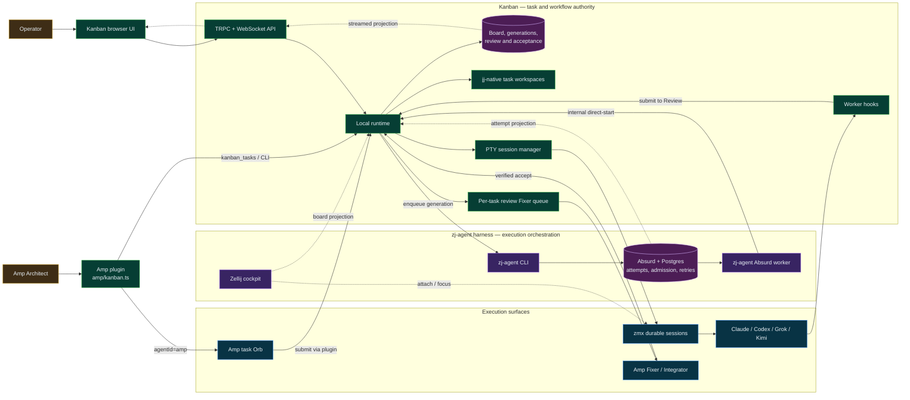

# Architecture Overview

Kanban is a local Node runtime plus a React app for running many coding-agent tasks in parallel.

There are three big ideas to hold in your head:

1. The browser is mostly a control surface. It renders state, sends commands, and reacts to live updates.
2. The local runtime is the source of truth for projects, worktrees, sessions, git operations, and streaming state.
3. Every agent runs the same way: as a PTY-backed CLI process in a task worktree.

If you remember nothing else, remember this:

- agents are process-oriented
- the backend coordinates everything through one runtime API and one state stream

## Decision record: Cline was removed as a Kanban worker

Kanban previously shipped a second execution path: Cline ran through a native
SDK-backed chat runtime (`src/cline-sdk/` on top of the published
`@clinebot/core` / `@clinebot/llms` packages), while every other agent ran as
a PTY-backed CLI process. The native runtime and the later external Cline
worker path have both been removed:

- `src/cline-sdk/` and its TRPC surface (provider settings, OAuth, MCP
  settings, task chat endpoints) are gone
- the `@clinebot/*` packages are no longer dependencies
- the Cline web-ui surfaces (chat panel, provider/model pickers, account and
  MCP settings) are gone
- Cline is not present in the agent catalog, launch adapters, task creation
  controls, or Amp task schema
- persisted cards that still reference Cline are retained as blocked legacy
  cards and must be reassigned before they can start

Tradeoff, stated plainly: removing the native runtime **diverges from upstream
`cline/kanban`**, so upstream merges will be harder — anything upstream that
touches `src/cline-sdk/`, the Cline chat UI, or the provider-settings TRPC
surface will conflict. We accepted that cost in exchange for a single agent
execution model, a much smaller dependency and cold-start surface (the SDK
host can no longer be started accidentally, e.g. on trash-restore probes), and
the removal of an entire settings/OAuth/MCP stack and an unused worker
integration.

## High-level dependency map

This diagram shows the runtime dependencies and authority boundaries around
Kanban. Solid arrows are commands or authoritative writes. Dashed arrows are
read-only projections, telemetry, or navigation.



The most important non-obvious split is that `zj-agent` is the adapter into
Absurd, while Absurd owns durable execution attempts. `zmx` keeps an admitted
worker process alive, and Zellij only observes or focuses it. The Amp plugin is
the Architect/task-tool boundary and owns the special Amp Orb path; it does not
replace Kanban task truth. A worker report, terminal process, pane, Orb thread,
or Absurd attempt can therefore never accept a card by itself.

## Request and Stream Diagram

```text
User action in UI
    |
    v
component
    |
    v
hook or runtime query helper
    |
    v
TRPC client
    |
    v
app-router.ts
    |
    v
runtime-api.ts
    |
    +--> terminal/session-manager.ts for all agents


Live runtime output
    |
    +--> terminal session summaries
    |
    v
runtime-state-hub.ts
    |
    v
websocket stream
    |
    v
browser runtime state hooks
    |
    v
board, detail view, and terminal panels
```

## The Mental Model

Kanban is easiest to understand if you separate it into three layers of responsibility.

The browser layer is the presentation and orchestration layer. It renders the board, detail view, settings, and terminal surfaces. It also owns short-lived UI state such as panel visibility, form drafts, and optimistic rendering.

The runtime layer is the control layer. It decides what session to start, where it should run, what worktree or workspace it belongs to, what command should be used, and what state should be streamed back to the browser.

The execution layer is the actual agent implementation: a CLI process attached
to a durable zmx session. Absurd owns the queued/running execution attempt and
admission; Kanban owns the task, generation, workspace, and deterministic zmx
identity. A terminal attachment is only a local projection of that execution.

That split explains a lot of the architecture:

- the browser should not be the source of truth for session or execution-attempt lifecycle
- the runtime should coordinate work, not render UI
- agent differences belong in the agent catalog and per-agent launch adapters, not in parallel runtime stacks

## Runtime Modes

Kanban currently supports two runtime modes.

| Runtime mode | Used for | Scope | Backing implementation | Why it exists |
| --- | --- | --- | --- | --- |
| CLI-backed task terminal | Claude Code, Codex, Grok, Kimi, Gemini, OpenCode, Droid, Kiro, and similar agents | task-scoped | PTY-backed process runtime | these agents are command-driven CLIs and already fit the terminal model well |
| Workspace shell terminal | the bottom shell panel | workspace-scoped | PTY-backed shell process | this is for manual commands in the repo, not task execution |

## Core Concepts

These terms come up everywhere in the codebase.

| Concept | Meaning | Why it matters |
| --- | --- | --- |
| Workspace | an indexed git repository that Kanban has opened | most browser and runtime state is scoped to a workspace |
| Task card | a board item with a prompt, base ref, and review settings | a task is the unit of work the board cares about |
| Worktree | a per-task git worktree | most task agents run inside one |
| Task session | the local runtime attachment associated with a task card | it is not proof that an Absurd attempt is queued or running |
| Runtime summary | the small state object the board uses to know whether a local session is idle, running, awaiting review, interrupted, or failed | this is a bounded runtime projection, not scheduler truth |

## Who Owns What

One of the biggest cleanup themes was making ownership clearer. The system is much easier to work on if every concern has one obvious owner.

| Concern | Primary owner | Notes |
| --- | --- | --- |
| board state, workspace state, review state | Kanban | this is product state |
| worktree lifecycle | Kanban | task worktrees are a Kanban concept |
| execution attempts, admission, waits, retries, and results | Absurd | Kanban may retain an attempt reference and bounded read-only status projection |
| deterministic zmx identity and process attachment | Kanban | retries within a task generation reuse the same identity |
| agent authentication and provider settings | each agent CLI | CLIs own their own login and config; Kanban only launches them |
| UI rendering state for detail view | browser hooks and components | local UI state belongs in the frontend |
| live state fanout to the browser | `runtime-state-hub.ts` | the browser should react to streamed state, not poll |

If a change feels awkward, it is often because ownership is being blurred.

## Backend Architecture

The backend has a few important subsystems, each with a different job.

### TRPC layer

`app-router.ts` defines the typed contract between the browser and the runtime.

`runtime-api.ts` is the coordinator behind that contract. It should be the front door for runtime procedures, but not the place where deep session logic accumulates. A good rule of thumb is that `runtime-api.ts` should route and validate, then hand off to the terminal runtime, workspace logic, config helpers, or git helpers.

### Terminal runtime

The `src/terminal/` area owns everything process-oriented:

- choosing what binary to run (via the agent catalog in `src/core/agent-catalog.ts`)
- per-agent launch preparation (hooks, env, args) in `agent-session-adapters.ts`
- launching PTY sessions
- resizing and streaming terminal output
- translating process lifecycle into Kanban runtime summaries
- handling the workspace shell terminal

This is the single execution path for every supported task agent.

### Workspace and config

`src/workspace/` owns worktree creation, lookup, cleanup, and turn checkpoints.

`src/config/runtime-config.ts` owns Kanban preferences such as selected agents, shortcuts, and prompt templates.

### State streaming

`runtime-state-hub.ts` is the central fanout point for live updates. It listens to terminal summaries, workspace metadata, and workspace state changes, then broadcasts websocket messages that keep the browser in sync.

This is important because Kanban is not designed around browser polling. The runtime is long-lived and streams state outward.

## Frontend Architecture

The frontend is also easier to navigate if you think in responsibilities instead of folders.

`App.tsx` is the composition root. It wires together the major hooks, determines which high-level surfaces are visible, and hands state down into the board, detail view, dialogs, and terminal areas. It should not become a second runtime orchestrator.

Hooks in `web-ui/src/hooks/` are where most domain logic lives. This includes project navigation, workspace synchronization, task-session actions, and review behavior. If you are looking for "how does this behavior actually work?", the answer is usually in a hook, not a component.

Components in `web-ui/src/components/` are mostly rendering and composition. Good frontend changes often mean moving runtime-aware logic into hooks and leaving the component to render a view model.

`web-ui/src/runtime/` holds client-side query helpers and persistence glue. One of the guardrails we now enforce is that raw workspace TRPC client creation should stay concentrated in the runtime query helpers rather than spread through arbitrary components.

## Configuration and Persistence

Different state lives in different places on purpose.

| State | Where it lives | Why |
| --- | --- | --- |
| selected agent, shortcuts, Kanban prompt templates | Kanban runtime config | these are Kanban preferences |
| per-project UI or workflow state | workspace state or project config | this is workspace-scoped product state |
| agent credentials and provider settings | each agent CLI's own config | the CLIs already own auth and provider persistence |
| task runtime summaries | Kanban runtime memory and state stream | the board needs a lightweight product-shaped summary of current work |
| Amp Architect task origin | immutable task metadata in workspace board state | operators can return to the planning context without making Amp a lifecycle authority |

## Amp Task Planning

Task decomposition lives in Amp through the self-contained `amp/kanban.ts` plugin. The plugin exposes typed Kanban task operations to the active Amp thread and a command-palette action that opens a native `medium` thread for focused decomposition. It can also start cards assigned to `amp` in an Orb and watches the native thread response before submitting successful work to review. Kanban does not embed a separate planning agent in the project sidebar.

When that plugin creates a task, it captures the active Architect thread as
immutable `origin.kind = "amp_architect"` metadata. Worker/Orb threads remain
separate execution context. The board renders a compact human label and the
detail view exposes the supported `amp threads continue <thread-id>` command;
neither surface can update task lifecycle from Amp thread state.

Task completion has two deliberately separate operations. `submit` moves in-progress work to review without cleanup or dependency unblocking; executors and runtime hooks use it when implementation is ready for inspection. `done` is the acceptance operation: it stops the session, removes the task workspace where appropriate, and unblocks linked work. An executor must not collapse those gates by calling `done` itself.

## Main Flows

### Starting a task session

The authoritative CLI/Amp start path enqueues a generation-fenced execution
reference through Absurd. After admission, the bounded Absurd worker invokes
the hidden direct-start entrypoint; Kanban revalidates the generation, resolves
the task workspace and effective worker, and attaches the deterministic zmx
session. As the process runs, the terminal runtime emits attachment summaries
and terminal output. The runtime state hub streams those projections back to
the browser.

The browser Start action uses the same enqueue boundary and receives a queued
receipt rather than manufacturing a running session summary. Its compact
execution reference also carries resume intent; after admission, direct-start
reconstructs task images and plan mode from the authoritative card. The direct
session endpoint rejects browser callers and accepts only the runtime's internal
bearer context used by the Absurd worker.

### Turn checkpoints

When a session starts (and when a hook moves a task to review), the runtime captures a best effort git checkpoint of the task worktree through the shared helper in `src/workspace/turn-checkpoints.ts`. Checkpoints power the "last turn" diff mode. Failures are swallowed on purpose: checkpointing must never block session startup or review transitions.

## Design Rules

These are the architectural rules that are most important to preserve.

- one concern should have one clear source of truth
- one agent execution path: PTY-backed CLI processes, parameterized by the agent catalog and launch adapters — do not add a second runtime stack
- keep `runtime-api.ts` as a coordinator, not a god file
- treat the browser as a client of streamed runtime state, not the source of truth for long-running sessions
- when adding new agent behavior, prefer capability-oriented reasoning over sprinkling agent-id string checks
- because this feature area currently has zero users to migrate, prefer clean replacement over backward-compatibility scaffolding

## Enforced Boundaries

Some of the highest-value rules are enforced automatically by lint.

- in the browser app, `createWorkspaceTrpcClient` is reserved for the runtime query helpers

These rules are intentionally narrow. They exist to protect the seams that are easiest to accidentally erode.

## Deliberate Tradeoffs

Not everything is perfectly generalized, and that is okay. Some current tradeoffs are intentional.

- removing Cline as a native runtime and external worker diverges from upstream
  `cline/kanban`, making upstream merges harder (see the decision record above)
- legacy Cline task records are migration input only; they are never launchable

The important thing is that these tradeoffs are now explicit. They are not random accidents spread through the codebase.

## Common Change Guide

When you are making a change, this table is often more useful than a file list.

| If you are changing... | Think about this first | Common mistake to avoid |
| --- | --- | --- |
| task startup for any agent | the PTY runtime and agent launch path | adding a second, agent-specific runtime path |
| Amp Orb task startup | the Amp plugin and its native thread watcher | inventing a second worker runtime or letting the worker accept its own card |
| live board updates | the runtime state hub and browser stream consumers | falling back to polling or duplicating summary logic |
| new architectural boundaries | the existing lint rules and ownership model | adding a rule that is too broad and becomes a nuisance |

## What A New Engineer Should Expect

A new engineer opening this repo will probably notice a few things quickly:

- the backend is long-lived and stateful, not a thin stateless API server
- the browser is closer to a local control client than a traditional web app
- the task system, review system, and runtime system are tightly connected
- every supported task agent runs through the same PTY-backed terminal runtime
- the architecture now favors clean ownership over compatibility glue because this area did not have legacy users to preserve

If you approach the code with those assumptions, the rest of the system starts to make sense much faster.
