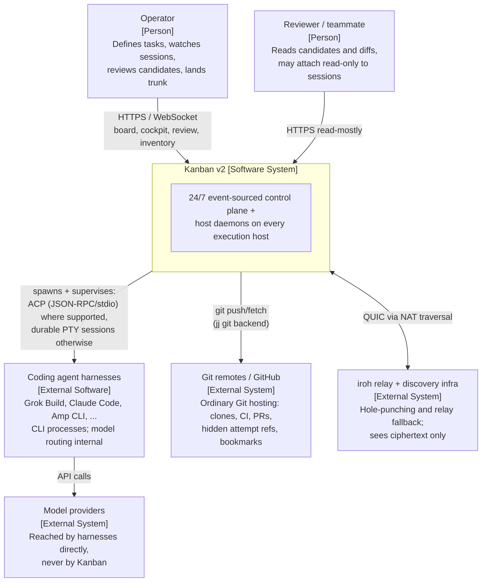

# C1 — System Context

Kanban v2 is a durable orchestration system for coding agents. One operator
(or a small team) uses it to define work, launch agent attempts on any
enrolled execution host, watch live sessions, review immutable candidates,
and land results on a trunk — while the system itself runs unattended on a
server.

## Context diagram

## Actors and systems

| Element | Type | Responsibility | Trust |
|---|---|---|---|
| Operator | Person | Creates tasks, starts/stops attempts, attaches to sessions, accepts/rejects candidates, moves trunk | Full authority via authenticated UI/API |
| Reviewer | Person | Inspects candidates, diffs, conflict heatmap; read-only session attach | Read-mostly; acceptance stays with operator role |
| **Kanban v2** | This system | The only writer of workflow truth (tasks, attempts, leases, workspaces, sessions, verdicts). Includes control plane **and** hostd instances on every execution host | Event log is authoritative |
| Agent harnesses | External software | Do the actual coding inside a leased jj workspace, as child processes owned by hostd — driven over ACP (structured tool calls, plans, permission requests) when the harness speaks it, or inside a durable PTY session otherwise | Untrusted-by-default child processes: they get a workspace lease, not credentials to the control plane; ACP permission requests resolve to typed control-plane approvals |
| Git remotes / GitHub | External system | Durable code exchange and normal open-source workflow (clone/CI/PR). Kanban uses hidden refs for attempt teleportation and bookmarks for trunk | Trusted for code bytes (content-addressed by Git/jj); never holds workflow state |
| iroh relays | External infra | Connectivity between control plane and hosts behind NATs | Untrusted: end-to-end encrypted QUIC; host identity = iroh NodeId keypair |
| Model providers | External system | LLM inference for harnesses | Out of scope; Kanban never proxies model traffic |

## Trust and failure boundaries

- **Cryptographic host identity.** An execution host *is* its iroh NodeId.
  Enrollment binds NodeId → host record via an event; every receipt (candidate
  published, workspace created, artifact hash) is signed by the host key.
- **Workflow truth lives in one place.** Only typed commands accepted by the
  control plane append events. Terminal output, session liveness, gossip, and
  host self-reports are telemetry feeding reconciliation.
- **Code truth is content-addressed.** jj change IDs and Git object hashes
  make candidates immutable; review examines a change ID, never a terminal
  scrollback.
- **Every boundary assumes the other side dies.** Operator ↔ control plane:
  sessions and attempts continue while the browser is closed. Control plane ↔
  host: leases expire, hostd keeps agents alive offline and reconciles on
  reconnect. Host ↔ agent: hostd restarts or fails the attempt per policy;
  reboot recovery is event-log replay plus workspace re-lease, never mux
  resurrection.
