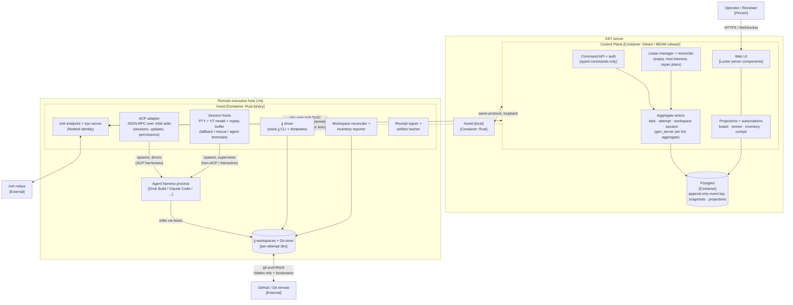

# C2 — Containers

The system is two deployable shapes: **one control-plane deployment** (BEAM
release + Postgres, on the 24/7 server) and **one `hostd` binary per
execution host** (including a hostd on the server itself for local
execution). Everything else is a client or an external system.

## Container diagram

## Containers

| Container | Tech | Responsibilities | State |
|---|---|---|---|
| **Control Plane** | Gleam/BEAM (OTP release) | Accepts typed commands; runs one actor per hot aggregate; appends events; manages leases; runs the reconciler; serves projections and the Lustre UI over WebSocket | None in-process that matters — every actor rebuilds from the event log on restart |
| **Postgres** | Postgres 16+ | Append-only event log (aggregate streams, global order), snapshots, projection tables, outbox for host commands | The single durable workflow store; backup = whole system state |
| **Web UI** | Lustre server components (in the BEAM release) | Board, session cockpit (terminal view), review (candidate diffs, conflict heatmap), **workspace inventory** | Stateless projection consumer |
| **hostd** | One static Rust binary | iroh endpoint + irpc server; ACP adapter + session hosts (below); jj CLI driver; workspace reconciler/inventory reporter; artifact hashing + receipt signing with the host NodeId key | Local manifest (sessions/workspaces it believes exist) — advisory cache only, re-derivable and always reconciled against the event log |
| **ACP adapter** | Module inside hostd | Spawns ACP-capable harnesses as child processes and speaks JSON-RPC over their stdio: `initialize`/capability negotiation, `session/new|prompt|cancel`, streams `session/update` (tool calls, plans, diffs, message chunks) to the control plane as telemetry, forwards `session/request_permission` as typed approval commands, and serves the client-side `fs` and `terminal` capabilities (agent-requested commands run in hostd-owned processes with retained output) | Persists harness `sessionId` ↔ attempt mappings and capability snapshots — advisory; ACP session history is agent-owned, so replay/resume is verified, never assumed |
| **Session host** | Thread/task group inside hostd (optionally a child process per attempt for isolation) | Owns the PTY via `portable-pty`; feeds bytes to a swappable VT model (`vt100` first) for screen snapshots; keeps a sequence-numbered bounded raw replay buffer; fans out to any number of viewers over irpc; injects input; enforces one authoritative PTY size. Used for non-ACP harnesses, auth/setup flows, interactive rescue, and rendering agent-requested terminals | In-memory; durable output is journaled to disk by hostd and referenced by hash in events |
| **Agent harness** | External CLI (Grok Build primary) | Implements the task inside its leased jj workspace | Its process tree is owned by hostd, via the ACP adapter or a session host |

## Agent control: ACP first, PTY fallback

**Decision: hostd drives harnesses over ACP (Agent Client Protocol) whenever
the harness supports it; the PTY session host is the fallback and rescue
path.** These solve different problems and the design needs both:

- **ACP is semantics.** Newline-delimited JSON-RPC over the child's stdio
  gives capability negotiation, `session/new|prompt|cancel`, streamed
  `session/update` (tool calls with status, plans, diffs-as-content, message
  and thought chunks), and `session/request_permission`. One adapter covers
  the whole ACP directory — Grok Build (ACP sessions), Gemini CLI, Goose,
  Claude Code via `claude-agent-acp`, Codex, OpenCode, Kimi, Cline, and
  others — with zero per-harness code in the control plane.
- **PTY is durability and humanity.** Non-ACP tools, harness auth/setup
  flows, interactive rescue of a stuck agent, and rendering of
  agent-requested terminals.

What ACP buys the event-sourced core:

1. **Permission gates become workflow events.** `session/request_permission`
   arrives with agent-proposed options (`allow_once`, `allow_always`,
   `reject_*`); hostd forwards it as a typed command, the operator (or
   policy) answers, `PermissionGranted/Denied` lands in the log, the option
   ID flows back. Replayable, auditable, automatable.
2. **The cockpit gets a semantic timeline.** Tool calls, plan snapshots, and
   diffs render structurally; the terminal view remains available but stops
   being the primary observation channel — consistent with "terminal output
   is telemetry, never truth."
3. **Inverted execution ownership.** hostd advertises the client-side
   `terminal` capability, so commands the agent wants to run execute in
   hostd-owned processes (`terminal/create…release`) with retained output —
   the agent never gets PTY custody, and command output can be journaled and
   hashed like any artifact.

Boundaries kept honest:

- ACP **session persistence is agent-owned** (`session/load`/`resume` behind
  capabilities). hostd persists sessionId↔attempt mappings but treats resume
  as an optimization to verify at reconnect — attempt lifecycle truth stays
  in the event log, exactly as with PTY sessions.
- ACP's standardized **remote transport is still a draft** (HTTP/SSE and
  WebSocket RFDs). v2.0 does not depend on it: ACP always runs over local
  stdio next to the agent, and irpc-over-iroh carries it across the network.
  If the proxy/remote RFDs stabilize, they slot in without moving truth.
- ACP updates are **telemetry** like terminal bytes: they inform projections
  and reconciliation; only typed commands append workflow events.

## Session-substrate decision

**Decision: hostd owns PTYs natively.** No external multiplexer (zmx, tmux,
shpool, wezterm-mux) in the runtime path. Multi-viewer fan-out comes from our
own irpc streaming; reattach state comes from the in-process VT model
(snapshot) plus the sequenced replay buffer (tail); durability across hostd
or host death comes from the event log + reconciliation — **which is the only
place it can come from, because no surveyed substrate survives its own daemon
or a reboot either.**

Survey results (2026-08, source-verified):

| Candidate | Topology | Multi-client | Machine API | Crash blast radius | Verdict |
|---|---|---|---|---|---|
| **zmx** | daemon per session | Yes (leader-based input) | CLI only; no JSON (open issue #220); private binary ABI, mixed-version hangs observed; no reboot recovery (issue #76) | One session | Good interactive tool; weak control-plane substrate |
| **shpool** | one daemon, many sessions | **No — single client per session** (`attach --force` evicts) | Good lifecycle CLI + JSONL events; no output subscription | All sessions on the daemon | Disqualified: supervisor and human contend for one exclusive attach |
| **tmux** (`-L` socket per attempt) | server per socket | Yes | Best-in-class: control mode `%output`, `pipe-pane`, `capture-pane`, stable IDs | One socket (per attempt if isolated) | Strong fallback; adds an external lifecycle authority and control-mode protocol parsing |
| **abduco/dtach** | daemon per session | Yes | Raw bytes only; no VT state, no replay of unobserved output | One session | Too little: control plane would rebuild everything anyway |
| **wezterm-mux-server** | one mux server | Yes, native | Rich CLI + mux protocol; internal crates explicitly unstable | Whole mux server | Adopting WezTerm's domain model as architecture; oversized |
| **Native (chosen)** | inside hostd (optional worker process per attempt) | Yes — our transport | Exactly our irpc schema | hostd (or per-attempt worker) | ~1.5–2.5k LoC Rust; validated by Tenex (portable-pty + vt100 + checkpoints), OpenCode (cursor-replay multi-subscriber), WezTerm (server-side VT deltas) |

Rationale, condensed:

1. hostd must exist regardless (leases, jj, inventory, receipts). An external
   mux adds a *second* lifecycle authority whose sessions still die with it.
2. The two things a mux uniquely offers — human reattach UX and multi-client —
   are ~2k LoC on top of `portable-pty` + `vt100`, with prior art proving each
   piece (Tenex, OpenCode, shpool's restore spool).
3. Every event, receipt, and stream then speaks one schema (irpc) with one
   identity (NodeId + attempt ID), instead of scraping CLIs with unstable
   output formats.

Fallback recorded: if native session hosting slips, `tmux -L kanban-<attempt>`
(one server per attempt) preserves crash isolation and multi-client with the
best external API, at the cost of control-mode glue roughly the size of the
native implementation.

## Key flows

Numbered flows below are the contract the containers must honor; each is
crash-recoverable at every step.

1. **Start attempt.** Operator command → `AttemptRequested` event →
   lease manager picks a host → irpc `CreateWorkspace` (jj driver: new
   workspace on the attempt's base change) → `WorkspaceLeased` (signed
   receipt) → irpc `StartAgent`. ACP-capable harness: the adapter spawns it,
   negotiates capabilities, opens `session/new` in the workspace, sends the
   task prompt → `AgentStarted` records the ACP sessionId. Otherwise: a
   session host spawns it in a PTY → `SessionStarted`. Any step timing out
   expires the lease and replans.
2. **Attach viewers.** Cockpit (or N cockpits) subscribes via control plane.
   ACP attempts stream a semantic timeline (tool calls, plan, diffs, message
   chunks) plus any agent-requested terminal output; pending
   `session/request_permission` gates surface as actionable approvals. PTY
   attempts stream the terminal: VT snapshot at sequence *s*, then raw bytes
   from *s*. Input/approval requires an explicit interactive grant; default
   attach is read-only. Attempts never pause when zero viewers are attached.
3. **Candidate + review.** Harness finishes → hostd snapshots the jj change
   (stable change ID), pushes a hidden attempt ref to the Git remote, signs a
   `CandidatePublished` receipt. Review UI shows the immutable change, its
   diff, and `jj evolog` time travel — never terminal scrollback.
4. **Conflict heatmap.** Control plane periodically asks an idle host to run
   speculative merges of open candidates against trunk (jj: conflicts are
   data, not stop-the-world). Result matrix is a projection; reviewers see
   which candidates collide before accepting.
5. **Accept / trunk move.** `CandidateAccepted` → jj driver advances the
   trunk bookmark and pushes; the trunk pointer is event state first, Git
   bookmark second. Rollback = accept a `TrunkMoved` to a prior change ID.
6. **Workspace teleport.** Any enrolled host can reconstruct any attempt
   workspace by fetching its hidden ref and creating a jj workspace at that
   change — recovery from a dead laptop is a fetch, not a restore.
7. **Failure & reconciliation.** hostd reconnect → control plane replays
   outstanding intents vs. host manifest: sessions alive? workspaces present
   at expected change? Divergence emits reconciliation events (restart, fail
   attempt, mark workspace `presence: missing`) — observed state, never
   silent mutation. Control-plane restart: actors rebuild from the log;
   hosts keep agents running meanwhile.
8. **Workspace inventory (v1 scope).** hostd's reconciler walks its
   workspace roots on a timer and on demand, reporting host, path, attempt
   ID, jj change ID, and observed presence. The inventory projection joins
   these reports with lease events. A `missing` report flags a row for
   operator action; only a typed `WorkspaceRetired` event deletes it.

## What is deliberately absent at C2

- No message broker: Postgres LISTEN/NOTIFY + in-BEAM pubsub suffice at this
  scale; gossip carries only lossy telemetry.
- No container orchestration requirement: hostd is one static binary.
- No custom jj backend or fabric storage: stock jj + ordinary Git remotes.
- No per-harness adapters in the control plane: hostd's single ACP adapter
  covers every ACP harness, and the PTY path speaks "spawn argv with env" —
  harness specifics live in task templates and capability snapshots, not code.
