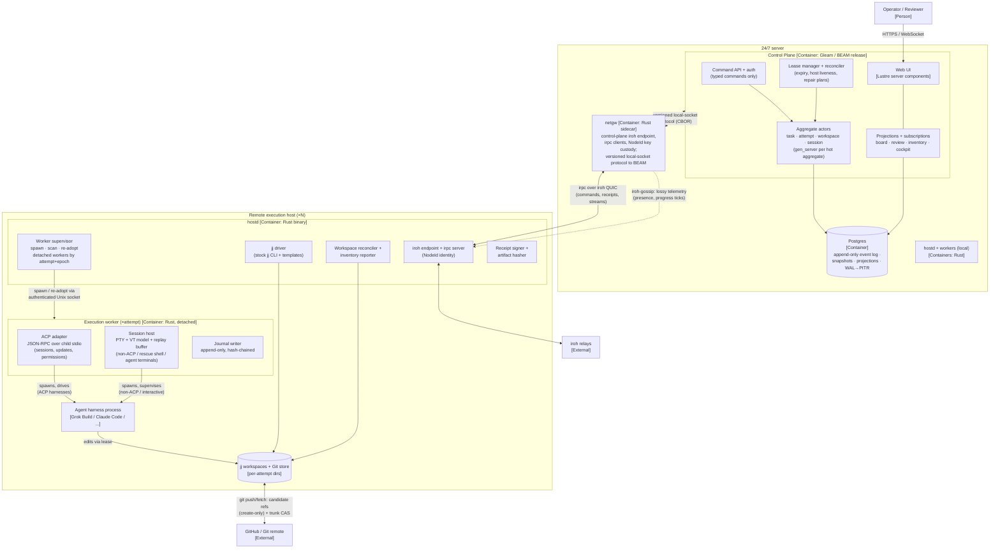

# C2 — Containers

The system is two deployable shapes: **one control-plane deployment** (BEAM
release + Postgres, on the 24/7 server) and **one `hostd` binary per
execution host** (including a hostd on the server itself for local
execution). Everything else is a client or an external system.

## Container diagram

## Containers

| Container | Tech | Responsibilities | State |
|---|---|---|---|
| **Control Plane** | Gleam/BEAM (OTP release) | Accepts typed commands; runs one actor per hot aggregate; appends events; manages leases; runs the reconciler; serves projections and the Lustre UI over WebSocket | None in-process that matters — every actor rebuilds from the event log on restart |
| **netgw** | Rust sidecar, supervised alongside the BEAM release | Owns the control-plane iroh endpoint, NodeId key custody, and all irpc client connections to hosts; verifies receipt signatures; bridges commands/receipts/streams to Gleam over a small versioned CBOR protocol on a local socket | Stateless beyond connection state; restart re-establishes host connections and resumes outbox drain — no truth lives here |
| **Postgres** | Postgres 16+ | Append-only event log (aggregate streams, commit-ordered), snapshots, projection tables, command inbox, outbox for host commands; WAL archived off-host for PITR | The single durable workflow store; backup = whole system state |
| **Web UI** | Lustre server components (in the BEAM release) | Board, session cockpit (terminal view), review (candidate diffs, conflict heatmap), **workspace inventory** | Stateless projection consumer |
| **hostd** | One static Rust binary | iroh endpoint + irpc server; worker supervisor (spawn, scan, **re-adopt** detached workers by attempt + lease epoch); jj CLI driver; workspace reconciler/inventory reporter; receipt signing with the host NodeId key; secrets brokering (host-scoped git credentials, attempt-scoped harness credentials — references only in events) | Local manifest (workers/workspaces it believes exist) — advisory cache only, re-derivable by scanning and always reconciled against the event log |
| **Execution worker** | Small Rust binary, one **detached process per attempt incarnation** (own process group, survives hostd restart/upgrade) | Owns the agent child end to end: ACP adapter or PTY session host (below), the append-only hash-chained journal, and a reconnectable authenticated Unix socket named by attempt + epoch. hostd re-adopts it after restart by scanning worker sockets and verifying identity | Journal on disk; in-memory VT/replay state; worker death = that attempt's channel death, nothing else |
| **ACP adapter** | Module inside the execution worker | Spawns ACP-capable harnesses and speaks JSON-RPC over their stdio: `initialize`/capability negotiation, `session/new|prompt|cancel`, streams `session/update` (tool calls, plans, diffs, message chunks) upward as telemetry, forwards `session/request_permission` as typed approval commands, and serves the client-side `fs` (lease-scoped) and `terminal` capabilities (agent-requested commands run in worker-owned processes with retained output) | Persists harness `sessionId` ↔ attempt+epoch mappings and capability snapshots — advisory; ACP session history is agent-owned, so `session/load`/`resume` is verified, never assumed |
| **Session host** | Module inside the execution worker | Owns the PTY via `portable-pty`; feeds bytes to a swappable VT model (`vt100` first) for screen snapshots; keeps a sequence-numbered bounded raw replay buffer; fans out to any number of viewers; injects input; enforces one authoritative PTY size. Used for non-ACP harnesses, auth/setup flows, **rescue shells (a separate shell in the workspace — never PTY attachment to a piped ACP child)**, and rendering agent-requested terminals | In-memory; durable output is journaled by the worker and referenced by hash in receipts |
| **Agent harness** | External CLI (Grok Build primary) | Implements the task inside its leased jj workspace | Its process tree is owned by exactly one execution worker |

## Agent control: ACP first, PTY fallback

**Decision: hostd drives harnesses over ACP (Agent Client Protocol) whenever
the harness supports it; the PTY session host is the fallback and rescue
path.** These solve different problems and the design needs both:

- **ACP is semantics.** Newline-delimited JSON-RPC over the child's stdio
  gives capability negotiation, `session/new|prompt|cancel`, streamed
  `session/update` (tool calls with status, plans, diffs-as-content, message
  and thought chunks), and `session/request_permission`. One adapter covers
  the whole ACP directory — Grok Build (ACP sessions), Gemini CLI, Goose,
  Claude Code via `claude-agent-acp`, Codex, OpenCode, Kimi, Cline, and
  others — with zero per-harness code in the control plane.
- **PTY is durability and humanity.** Non-ACP tools, harness auth/setup
  flows, rescue shells, and rendering of agent-requested terminals. A
  "rescue" is a **separate interactive shell in the attempt's workspace** —
  a process started with piped stdio can never be retrofitted with a PTY.

Protocol discipline the adapter must enforce (ACP v1 pinned; v2 draft
tracked, not depended on): strict stdout validation (any non-JSON-RPC bytes
on stdout → protocol-fault state, stderr → journal), deadlines on
`initialize`, prompt turns, and permission answers, and a cancellation
escalation ladder `session/cancel` → SIGTERM → SIGKILL with an
uncertain-outcome state (`AgentUnresponsive`) that the control plane
resolves via typed repair, never by silent retry of possibly-executed tools.

What ACP buys the event-sourced core:

1. **Permission gates become workflow events.** `session/request_permission`
   arrives with agent-proposed options (`allow_once`, `allow_always`,
   `reject_*`); hostd forwards it as a typed command, the operator (or
   policy) answers, `PermissionGranted/Denied` lands in the log, the option
   ID flows back. Replayable, auditable, automatable.
2. **The cockpit gets a semantic timeline.** Tool calls, plan snapshots, and
   diffs render structurally; the terminal view remains available but stops
   being the primary observation channel — consistent with "terminal output
   is telemetry, never truth."
3. **Inverted execution ownership.** hostd advertises the client-side
   `terminal` capability, so commands the agent wants to run execute in
   hostd-owned processes (`terminal/create…release`) with retained output —
   the agent never gets PTY custody, and command output can be journaled and
   hashed like any artifact.

Boundaries kept honest:

- ACP **session persistence is agent-owned** (`session/load`/`resume` behind
  capabilities). hostd persists sessionId↔attempt mappings but treats resume
  as an optimization to verify at reconnect — attempt lifecycle truth stays
  in the event log, exactly as with PTY sessions.
- ACP's standardized **remote transport is still a draft** (HTTP/SSE and
  WebSocket RFDs). v2.0 does not depend on it: ACP always runs over local
  stdio next to the agent, and irpc-over-iroh carries it across the network.
  If the proxy/remote RFDs stabilize, they slot in without moving truth.
- ACP messages split into two classes, and the docs keep them distinct:
  **lossy updates** (`session/update` chunks, plans, tool-call progress) are
  telemetry that informs projections and may be dropped; **state-bearing
  claims** (`session/request_permission`, terminal exit results, final turn
  outcomes) are converted by the worker into signed receipts/commands that
  the control plane validates before appending events. "Telemetry never
  mutates truth" means the lossy class; claims mutate truth only through
  the typed command path.

## Session-substrate decision

**Decision: PTYs are owned natively by detached per-attempt execution
workers.** No external multiplexer (zmx, tmux, shpool, wezterm-mux) in the
runtime path. Multi-viewer fan-out comes from our own streaming; reattach
state comes from the in-process VT model (snapshot) plus the sequenced
replay buffer (tail); reboot durability comes from the event log +
reconciliation — no surveyed substrate survives a reboot either.

The worker split answers the one failure the mux tools *do* survive that a
monolithic daemon would not: **hostd restart/upgrade**. Workers are detached
processes (own process group) that keep the agent, PTY, and journal alive
while hostd restarts; hostd re-adopts them by scanning their authenticated
sockets and verifying attempt + lease epoch. This keeps the crash-isolation
benefit that made zmx attractive, without its unstable ABI, and keeps the
machine API ours.

Survey results (2026-08, source-verified):

| Candidate | Topology | Multi-client | Machine API | Crash blast radius | Verdict |
|---|---|---|---|---|---|
| **zmx** | daemon per session | Yes (leader-based input) | CLI only; no JSON (open issue #220); private binary ABI, mixed-version hangs observed; no reboot recovery (issue #76) | One session | Good interactive tool; weak control-plane substrate |
| **shpool** | one daemon, many sessions | **No — single client per session** (`attach --force` evicts) | Good lifecycle CLI + JSONL events; no output subscription | All sessions on the daemon | Disqualified: supervisor and human contend for one exclusive attach |
| **tmux** (`-L` socket per attempt) | server per socket | Yes | Best-in-class: control mode `%output`, `pipe-pane`, `capture-pane`, stable IDs | One socket (per attempt if isolated) | Strong fallback; adds an external lifecycle authority and control-mode protocol parsing |
| **abduco/dtach** | daemon per session | Yes | Raw bytes only; no VT state, no replay of unobserved output | One session | Too little: control plane would rebuild everything anyway |
| **wezterm-mux-server** | one mux server | Yes, native | Rich CLI + mux protocol; internal crates explicitly unstable | Whole mux server | Adopting WezTerm's domain model as architecture; oversized |
| **Native (chosen)** | inside hostd (optional worker process per attempt) | Yes — our transport | Exactly our irpc schema | hostd (or per-attempt worker) | ~1.5–2.5k LoC Rust; validated by Tenex (portable-pty + vt100 + checkpoints), OpenCode (cursor-replay multi-subscriber), WezTerm (server-side VT deltas) |

Rationale, condensed:

1. hostd must exist regardless (leases, jj, inventory, receipts). An external
   mux adds a *second* lifecycle authority whose sessions still die with it.
2. The two things a mux uniquely offers — human reattach UX and multi-client —
   are ~2k LoC on top of `portable-pty` + `vt100`, with prior art proving each
   piece (Tenex, OpenCode, shpool's restore spool).
3. Every event, receipt, and stream then speaks one schema (irpc) with one
   identity (NodeId + attempt ID), instead of scraping CLIs with unstable
   output formats.

Fallback recorded: if native session hosting slips, `tmux -L kanban-<attempt>`
(one server per attempt) preserves crash isolation and multi-client with the
best external API, at the cost of control-mode glue roughly the size of the
native implementation.

## Key flows

Numbered flows below are the contract the containers must honor; each is
crash-recoverable at every step. Every host-bound command carries the
attempt's **lease epoch**; hosts embed it in worker identity, receipts, and
ref names, and aggregates reject anything stale — fencing, not hope.

0. **Host enrollment.** Operator mints a one-time enrollment token → new
   host runs `hostd enroll <token>` → mutual NodeId pinning (host learns and
   pins the control-plane NodeId; control plane records the host NodeId +
   security profile) → `HostEnrolled`. Reinstalled host = new NodeId = new
   enrollment; `HostRevoked`/`HostKeyRotated` are typed events.
1. **Start attempt.** Operator command → `AttemptRequested` event →
   placement reserves capacity durably → `CreateWorkspace{attempt, epoch}`
   (jj driver: new workspace at a deterministic path derived from
   attempt + epoch; an existing mismatched directory is refused, an existing
   matching one is the same outcome replayed) → `WorkspaceLeased` (signed
   receipt) → `StartAgent{epoch}` → worker supervisor spawns a detached
   execution worker. ACP-capable harness: the adapter negotiates
   capabilities, opens `session/new`, sends the task prompt →
   `AgentStarted` records the ACP sessionId + worker identity. Otherwise a
   PTY session → `SessionStarted`. Any step timing out expires the lease,
   bumps the epoch, and replans.
2. **Attach viewers.** Cockpit (or N cockpits) subscribes via control plane.
   ACP attempts stream a semantic timeline (tool calls, plan, diffs, message
   chunks) plus any agent-requested terminal output; pending
   `session/request_permission` gates surface as actionable approvals. PTY
   attempts stream the terminal: VT snapshot at sequence *s*, then raw bytes
   from *s*. Disconnected-period history is retrievable from the worker
   journal by cursor. Input/approval requires an explicit interactive grant;
   default attach is read-only. Attempts never pause with zero viewers.
3. **Candidate + review.** Harness finishes → control plane assigns a
   `CandidateId` → host snapshots the jj change and pushes **create-only**
   to `refs/kanban/candidates/<attempt_id>/<epoch>/<candidate_id>` → the signed
   `CandidatePublished` receipt carries `{candidate_id, git_commit_oid,
   jj_change_id, ref_name, journal_hash, epoch}`. The **Git commit OID is
   the review and reconstruction authority**; the jj change ID is metadata.
   A retried publish reads the existing ref and returns the same outcome —
   idempotent by construction, not by dedupe cache. Review UI shows the
   immutable commit, its diff, and local `jj evolog` where available.
   Candidate refs are GC'd only by typed `CandidateRetired` events.
4. **Conflict heatmap (advisory).** Control plane periodically asks an idle
   host to run speculative merges of open candidates against a **pinned
   trunk OID** (jj: conflicts are data). Each matrix cell records its exact
   input OIDs and `computed_at`; cells are hints for reviewers, never
   acceptance authority — landing re-verifies against the current trunk.
5. **Accept / trunk move (saga).** `CandidateAccepted` records the verdict.
   Then `TrunkMoveRequested{expected_old_oid, candidate_oid}` → host
   executes a compare-and-swap push (force-with-lease semantics) → success
   receipt emits `TrunkMoved`; failure emits `TrunkMoveConflicted`, fetches
   the external advance (humans and CI may push trunk too), and the operator
   rebases or re-accepts. Desired state is never recorded as fact before
   the remote CAS succeeds. Rollback = a new accepted `TrunkMoveRequested`
   to a prior OID.
6. **Workspace reconstruction.** Any enrolled host can build a fresh jj
   workspace at a candidate's Git commit OID by fetching its candidate ref —
   recovery from a dead laptop is a fetch, not a restore. This reconstructs
   the *code state*; jj op-log/evolog history stays host-local (cross-host
   evolog is a deferred scope gate).
7. **Failure & reconciliation.** hostd restart: workers survive detached;
   hostd rescans worker sockets and re-adopts by attempt + epoch. Worker
   death: that attempt's channel dies alone; the control plane replans.
   hostd reconnect after partition: control plane diffs outstanding intents
   vs. host manifest — sessions alive? workspaces at expected state? —
   and emits typed repair (`RestartAgent`, `FailAttempt`,
   `MarkWorkspacePresence`). Work continued under an expired lease is
   **quarantined**: its receipts carry a stale epoch and are rejected from
   the normal path until an operator explicitly adopts them. Control-plane
   restart: actors rebuild from the log; hosts keep agents running.
8. **Workspace inventory (v1 scope).** hostd's reconciler walks its
   workspace roots on a timer and on demand, reporting host, path, attempt
   ID + epoch, jj change ID (metadata), current **git commit OID/tree state**
   vs. the expected pinned OID, and observed presence (`present` / `missing` /
   `drifted`) — drift detection uses the OID, since a jj change ID survives
   rewrites. The inventory projection joins these observations with lease
   events. A `missing` report flags a row for operator action; only a typed
   `WorkspaceRetired` event deletes it.

## What is deliberately absent at C2

- No message broker: Postgres LISTEN/NOTIFY + in-BEAM pubsub suffice at this
  scale; gossip carries only lossy telemetry.
- No container orchestration requirement: hostd is one static binary.
- No custom jj backend or fabric storage: stock jj + ordinary Git remotes.
- No per-harness adapters in the control plane: hostd's single ACP adapter
  covers every ACP harness, and the PTY path speaks "spawn argv with env" —
  harness specifics live in task templates and capability snapshots, not code.
