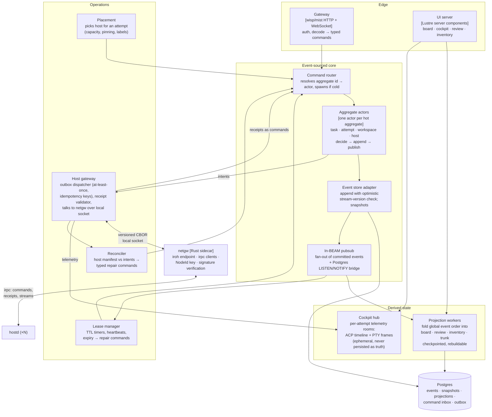
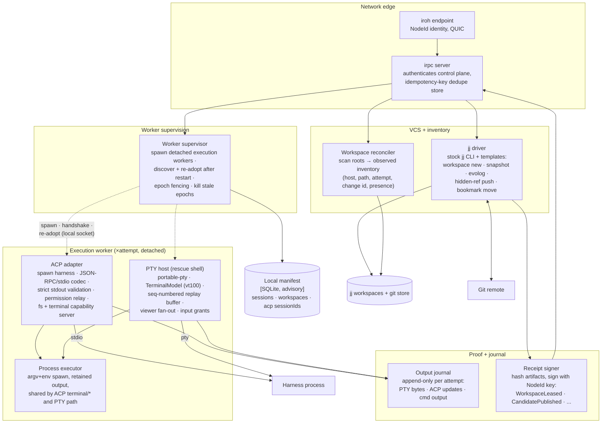

# C3 — Components

Component views for the two containers where the design is actually decided:
the **Gleam Control Plane** and the **Rust hostd**. Postgres is schema (see
[c4-code.md](./c4-code.md)); the Web UI is four projection-subscribing views
and gets a short section, not a diagram.

## Control Plane (Gleam / BEAM)

| Component | Responsibility | Failure story |
|---|---|---|
| Gateway | Terminates HTTPS/WS, authenticates the operator, decodes requests into typed commands; rejects anything that is not a known command | Stateless; restart is invisible |
| Command router | Maps `stream_id` → aggregate actor via `Registry`-style lookup; spawns cold actors (snapshot + tail replay) | Actor crash → supervisor restarts → rebuild from log |
| Aggregate actors | The only writers. Decode + upcast raw event envelopes, then `decide(state, cmd) → Events \| Rejection`, `evolve(state, event) → state`; append with expected-version; then publish. A command inbox table makes duplicate command IDs replay the original outcome | Optimistic-concurrency conflict → reload and retry with bounded deadline; impossible recorded transitions quarantine the stream loudly, never silently no-op |
| Event store adapter | Single append path to Postgres; **commit-ordered position** via a counter row locked inside the short append transaction (an identity column orders allocation, not commit, and would let projections permanently skip late-committing events); snapshots carry schema version + checksum and are discarded when unupgradable | Postgres down → commands fail fast and honestly; no dual-write anywhere |
| Pubsub | Fans committed events to projections, lease manager, UI; bridges LISTEN/NOTIFY so a restarted node catches up from checkpoints | Lossy by design — every consumer is checkpoint + replay |
| Projection workers | Fold events into read tables; projection write + checkpoint advance in one transaction; production rebuilds run as a **versioned shadow projection** (build alongside, batched checkpoints, atomic swap) | Corrupt projection is never a data-loss event; `DROP + replay` is the offline repair path only |
| netgw (sidecar) | Rust process owning the iroh endpoint, control-plane NodeId key, irpc clients, and ed25519 verification; exposes a small versioned CBOR protocol on a local socket so the BEAM never links Rust | Supervised externally (systemd); crash drops connections only — outbox redelivers, hosts are unaffected; protocol version negotiated at connect |
| Cockpit hub | Ephemeral per-attempt rooms distributing ACP updates and PTY frames to attached viewers | Loses nothing that matters: truth is in the log, output journal on the host |
| Placement | Chooses a host for `AttemptRequested` from host projections (capacity, labels, stickiness) | Wrong choice is recoverable: lease expiry replans |
| Lease manager | Owns TTLs for workspace/agent leases; heartbeat bookkeeping; expiry emits repair commands, never mutates directly | Timers rebuilt from event log on restart |
| Reconciler | On host reconnect or schedule: diff host manifest vs event-log intents; emit typed repair commands (`RestartAgent`, `FailAttempt`, `MarkWorkspacePresence`) | Idempotent; safe to rerun always |
| Host gateway | Drains the Postgres outbox with idempotency keys and per-attempt lease epochs; hands frames to netgw over the local socket; validates receipt structure and epoch before turning receipts into commands (netgw already verified the signature) | At-least-once delivery + hostd-side dedupe = effectively-once; netgw restart is a redelivery, not a loss |

The BEAM supervision tree mirrors this table: `core` and `ops` are separate
supervisors; one host's gateway connection crashing restarts only that
connection; projection workers restart independently of the write path.

## hostd (Rust)

| Component | Responsibility | Failure story |
|---|---|---|
| iroh endpoint + irpc server | Only ingress. Accepts exactly **one** peer identity — the pinned control-plane NodeId; viewers are always proxied through the control plane, which enforces operator roles and input grants. Every mutating RPC carries an idempotency key checked against the durable command journal | Connection loss changes nothing locally; agents keep running |
| Command journal | Durable (`received → in_progress → completed(outcome)`) record per idempotency key; replays recorded `CommandOutcome`s for duplicates; `in_progress` after restart triggers operation-specific reconciliation before answering | This is host truth-of-record for effects, unlike the advisory manifest; corrupt journal = re-enrollment-grade incident, surfaced loudly |
| Worker supervisor | Spawns one **detached** execution worker per attempt epoch (own process group, survives hostd); handshakes over a per-worker local socket; after hostd restart, scans worker sockets and re-adopts by (attempt, epoch); kills workers whose epoch the control plane has fenced off | hostd restart: agents keep running; re-adoption restores custody; a worker that fails handshake is quarantined and reported, never silently killed |
| Execution worker | One per attempt epoch. Owns the ACP child *or* the PTY rescue shell, the VT model, the replay buffer, the **claim spool** (seq-numbered, never dropped, blocks the agent when full), and the bounded telemetry journal for its attempt; identity embeds attempt ID + lease epoch | Worker crash kills one attempt's execution, not the daemon or other attempts; on re-adoption hostd replays unacked claims from the spool; control plane sees `AgentExited` and replans |
| ACP adapter (in worker) | Spawns the harness with **piped stdio** (never a PTY — a piped child cannot later acquire one; interactive rescue is the separate PTY shell); `initialize` pinned to ACP v1; strict JSON-RPC validation on stdout, stderr to journal; `session/update` is lossy telemetry, while permission requests, terminal exit results, and final outcomes become claims routed upstream as typed commands; cancellation ladder `session/cancel` → SIGTERM → SIGKILL, surfacing `AgentUnresponsive` when the outcome is uncertain | Malformed stdout or missed deadline → protocol fault recorded, agent killed via the ladder; continuity after respawn is a best-effort `session/load` transcript comparison, reported honestly as match/mismatch/unsupported |
| PTY host (in worker) | Rescue shell in the same attempt workspace: PTY custody, VT screen state, sequence-numbered replay, N viewers, single authoritative size, input only with an explicit grant | Crash kills one attempt's terminal, not the worker's journal |
| Process executor | One place that spawns argv+env with retained, hashed output — used by ACP `terminal/create` and PTY bootstrap | Output is journaled before exit status is reported |
| jj driver | All VCS effects via stock `jj` CLI with `--no-pager` and templates for machine-readable output; never parses human formatting | jj failures are captured verbatim into the receipt/refusal |
| Workspace reconciler | Periodic + on-demand scan of workspace roots; emits observed inventory (`present`, `missing`, `drifted`) — drift compares the current **git commit OID/tree** against the expected pinned OID (a jj change id survives rewrites, so it cannot detect drift alone) — observations, never deletions | A wrong scan is corrected by the next scan; truth unaffected |
| Output journal | Append-only files per attempt (PTY bytes, ACP update frames, command output), hash-chained; referenced by hash in receipts | Disk pressure → bounded retention, oldest-first, never blocks the agent |
| Receipt signer | Signs every state-bearing claim with the host key so the control plane verifies provenance before appending events | Unsigned/garbled receipt → rejected upstream, reconciler investigates |
| Local manifest | SQLite cache of what this host believes exists | Deletable at any time; rebuilt by scanning + reconciliation |

## Web UI (brief)

Four Lustre server-component views, all reading projections and the cockpit
hub; none holds truth: **Board** (tasks/attempts per project), **Cockpit**
(semantic ACP timeline with permission gates, terminal panel from PTY
frames), **Review** (candidate change, diff, `evolog`, conflict heatmap,
accept/reject commands), **Inventory** (every non-retired workspace:
host, path, attempt, change id, observed presence, retire action).
