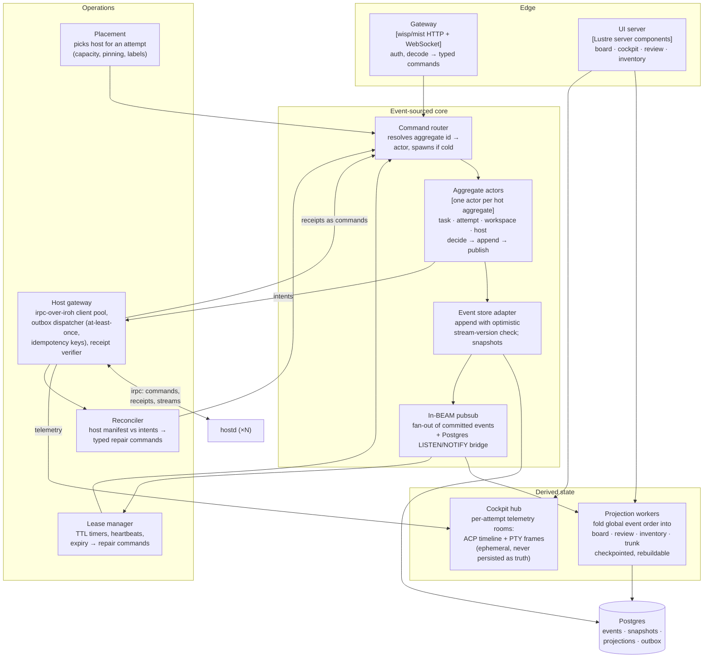
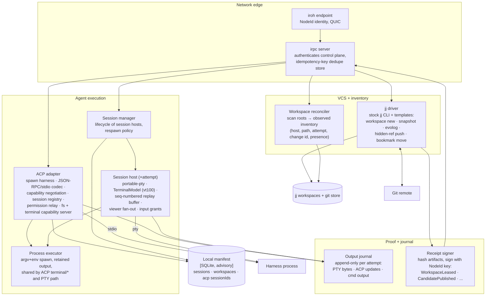

# C3 — Components

Component views for the two containers where the design is actually decided:
the **Gleam Control Plane** and the **Rust hostd**. Postgres is schema (see
[c4-code.md](./c4-code.md)); the Web UI is four projection-subscribing views
and gets a short section, not a diagram.

## Control Plane (Gleam / BEAM)

| Component | Responsibility | Failure story |
|---|---|---|
| Gateway | Terminates HTTPS/WS, authenticates the operator, decodes requests into typed commands; rejects anything that is not a known command | Stateless; restart is invisible |
| Command router | Maps `stream_id` → aggregate actor via `Registry`-style lookup; spawns cold actors (snapshot + tail replay) | Actor crash → supervisor restarts → rebuild from log |
| Aggregate actors | The only writers. `decide(state, cmd) → Events \| Rejection`, `evolve(state, event) → state`; append with expected-version; then publish | Optimistic-concurrency conflict → reload and retry once, else reject |
| Event store adapter | Single append path to Postgres; assigns global order; snapshot every N events | Postgres down → commands fail fast and honestly; no dual-write anywhere |
| Pubsub | Fans committed events to projections, lease manager, UI; bridges LISTEN/NOTIFY so a restarted node catches up from checkpoints | Lossy by design — every consumer is checkpoint + replay |
| Projection workers | Fold events into read tables; each owns a checkpoint; `DROP TABLE` + replay is the recovery procedure | Corrupt projection is never a data-loss event |
| Cockpit hub | Ephemeral per-attempt rooms distributing ACP updates and PTY frames to attached viewers | Loses nothing that matters: truth is in the log, output journal on the host |
| Placement | Chooses a host for `AttemptRequested` from host projections (capacity, labels, stickiness) | Wrong choice is recoverable: lease expiry replans |
| Lease manager | Owns TTLs for workspace/agent leases; heartbeat bookkeeping; expiry emits repair commands, never mutates directly | Timers rebuilt from event log on restart |
| Reconciler | On host reconnect or schedule: diff host manifest vs event-log intents; emit typed repair commands (`RestartAgent`, `FailAttempt`, `MarkWorkspacePresence`) | Idempotent; safe to rerun always |
| Host gateway | Holds iroh connections to every enrolled NodeId; drains the Postgres outbox with idempotency keys; verifies receipt signatures against host NodeId before turning them into commands | At-least-once delivery + hostd-side dedupe = effectively-once |

The BEAM supervision tree mirrors this table: `core` and `ops` are separate
supervisors; one host's gateway connection crashing restarts only that
connection; projection workers restart independently of the write path.

## hostd (Rust)

| Component | Responsibility | Failure story |
|---|---|---|
| iroh endpoint + irpc server | Only ingress. Accepts exactly one peer identity (the control plane) plus enrolled viewer tokens; every mutating RPC carries an idempotency key checked against the dedupe store | Connection loss changes nothing locally; agents keep running |
| ACP adapter | Owns ACP children: spawn, `initialize`, `session/new|prompt|cancel`; streams `session/update` upward as telemetry; converts `session/request_permission` into an upstream approval RPC and blocks the agent until the typed answer returns; serves `fs/*` (lease-scoped paths only) and `terminal/*` via the process executor | Adapter task panics → session manager respawns; on reconnect it verifies `session/load`/`resume` against the recorded sessionId before claiming continuity |
| Session manager | Start/stop/respawn session hosts per control-plane intent; reports session liveness in the manifest | hostd restart: re-adopts nothing (PTY children died with it) — reports loss, control plane replans |
| Session host | PTY custody, VT screen state, sequence-numbered replay, N viewers, single authoritative size, input only with an explicit grant | Crash kills one attempt's terminal, not the daemon |
| Process executor | One place that spawns argv+env with retained, hashed output — used by ACP `terminal/create` and PTY session bootstrap | Output is journaled before exit status is reported |
| jj driver | All VCS effects via stock `jj` CLI with `--no-pager` and templates for machine-readable output; never parses human formatting | jj failures are captured verbatim into the receipt/refusal |
| Workspace reconciler | Periodic + on-demand scan of workspace roots; emits observed inventory (`present`, `missing`, `drifted(change_id)`) — observations, never deletions | A wrong scan is corrected by the next scan; truth unaffected |
| Output journal | Append-only files per attempt (PTY bytes, ACP update frames, command output), hash-chained; referenced by hash in receipts | Disk pressure → bounded retention, oldest-first, never blocks the agent |
| Receipt signer | Signs every state-bearing claim with the host key so the control plane verifies provenance before appending events | Unsigned/garbled receipt → rejected upstream, reconciler investigates |
| Local manifest | SQLite cache of what this host believes exists | Deletable at any time; rebuilt by scanning + reconciliation |

## Web UI (brief)

Four Lustre server-component views, all reading projections and the cockpit
hub; none holds truth: **Board** (tasks/attempts per project), **Cockpit**
(semantic ACP timeline with permission gates, terminal panel from PTY
frames), **Review** (candidate change, diff, `evolog`, conflict heatmap,
accept/reject commands), **Inventory** (every non-retired workspace:
host, path, attempt, change id, observed presence, retire action).
