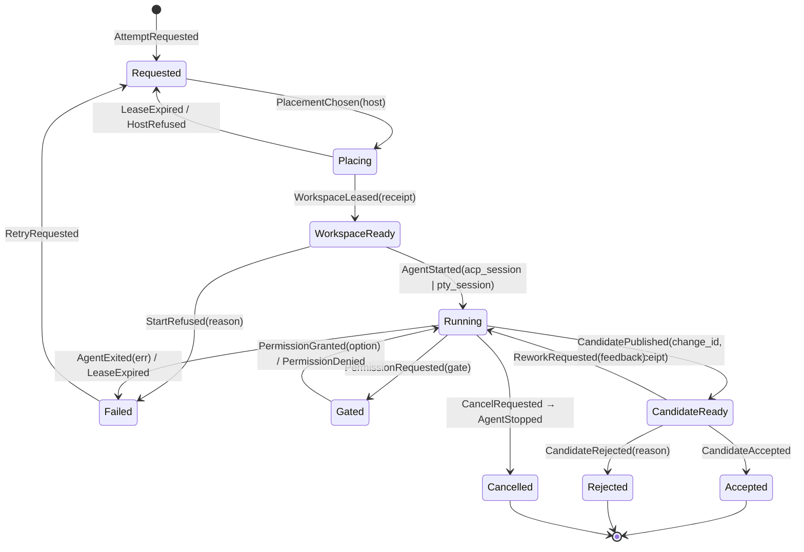

# C4 — Code

C4-level views only for the load-bearing elements — the ones where a wrong
shape is expensive to reverse. Everything else (HTTP handlers, projections,
UI views, jj command strings) is deliberately not specified here; it follows
from these types.

Covered:

1. The attempt aggregate: state machine + Gleam `decide`/`evolve` types
2. The event store: Postgres schema + append contract
3. The host protocol: irpc types + idempotency + receipts
4. The session host and ACP adapter: Rust core types

## 1. Attempt aggregate (Gleam)

The attempt is the busiest aggregate and the template for all others
(task, workspace, host follow the same pattern with smaller alphabets).

### State machine



Every transition is an event; every event carries the receipt or command
that justified it. `Failed → Requested` (retry) creates a **new workspace
lease** — workspaces are per-attempt-incarnation, never reused blindly.

### Types

```gleam
// ids are opaque, validated once at the boundary
pub type AttemptId { AttemptId(String) }
pub type HostId { HostId(iroh_node_id: String) }
pub type ChangeId { ChangeId(String) } // jj change id, stable across rewrites

pub type AgentChannel {
  Acp(session_id: String, capabilities: AcpCaps)
  Pty(session_seq_start: Int)
}

pub type AttemptState {
  Requested(task: TaskId, spec: AttemptSpec)
  Placing(host: HostId, lease_deadline: Timestamp)
  WorkspaceReady(host: HostId, workspace: WorkspaceId, base: ChangeId)
  Running(host: HostId, workspace: WorkspaceId, channel: AgentChannel)
  Gated(inner: AttemptState, gate: PermissionGate)
  CandidateReady(candidate: ChangeId, receipt: Receipt)
  Accepted(candidate: ChangeId)
  Rejected(candidate: ChangeId, reason: String)
  Failed(reason: FailReason)
  Cancelled
}

pub type PermissionGate {
  PermissionGate(
    gate_id: String,
    tool_call: AcpToolCallRef,
    options: List(PermissionOption), // agent-proposed: allow_once, allow_always, ...
    requested_at: Timestamp,
  )
}
```

### The aggregate contract

Same two pure functions for every aggregate; the actor shell is generic.

```gleam
pub type Decision {
  Accept(events: List(AttemptEvent))
  Reject(reason: RejectReason)
}

/// Pure. May reject. Never performs IO.
pub fn decide(state: AttemptState, cmd: AttemptCommand) -> Decision

/// Pure. Total for all recorded events (replay must never crash):
/// unknown-in-this-state events fold to state unchanged + an anomaly mark.
pub fn evolve(state: AttemptState, event: AttemptEvent) -> AttemptState
```

The actor shell (one per hot aggregate) is the only impure part:

```gleam
// generic over any aggregate A
fn handle(cmd) {
  let state = snapshot |> list.fold(tail_events, evolve)
  case decide(state, cmd) {
    Reject(r) -> reply(Error(r))
    Accept(events) ->
      // single transaction: append + outbox intents, expected-version guarded
      case event_store.append(stream_id, expected_version, events, intents) {
        Ok(v) -> { publish(events); reply(Ok(v)) }
        Error(VersionConflict) -> retry_once_with_fresh_state(cmd)
      }
  }
}
```

Rules the code must keep true:

- **Receipts gate transitions.** `WorkspaceLeased`, `CandidatePublished`,
  `AgentStarted` are only decidable from a signature-verified host receipt.
- **`Gated` wraps `Running`** so a permission gate cannot lose the running
  context, and cancel works identically in both.
- **Host intents ride the same transaction** as events (outbox), so "event
  says start agent, but nobody told the host" is unrepresentable.

## 2. Event store (Postgres)

```sql
create table events (
  global_seq   bigint generated always as identity primary key,
  stream_id    text        not null,   -- "attempt/<id>", "workspace/<id>", ...
  stream_seq   bigint      not null,   -- optimistic concurrency
  event_type   text        not null,   -- "attempt.candidate_published.v1"
  data         jsonb       not null,
  meta         jsonb       not null,   -- command id, actor, causation, receipt sig
  recorded_at  timestamptz not null default now(),
  unique (stream_id, stream_seq)
);

create table snapshots (
  stream_id   text primary key,
  stream_seq  bigint not null,
  state       jsonb  not null
);

create table outbox (
  id              bigint generated always as identity primary key,
  host_id         text  not null,          -- iroh NodeId
  idempotency_key uuid  not null unique,
  command         jsonb not null,
  created_seq     bigint not null references events (global_seq),
  dispatched_at   timestamptz,
  acked_at        timestamptz
);

create table checkpoints (
  projection  text primary key,
  global_seq  bigint not null
);
```

Append contract (one transaction, the only write path):

```sql
-- fails with serialization error if stream_seq already exists → actor retries
insert into events (stream_id, stream_seq, event_type, data, meta)
  values ($1, $2 + 1, $3, $4, $5);
insert into outbox (host_id, idempotency_key, command, created_seq) ...;
select pg_notify('events', $global_seq);
```

Versioning policy: event types are suffixed (`.v1`); upcasting happens at
read time in `evolve` decoders; events are never rewritten.

## 3. Host protocol (irpc over iroh)

```rust
/// Control plane → hostd. Every variant carries the outbox idempotency key.
pub enum HostCommand {
    CreateWorkspace { key: Uuid, attempt: AttemptId, repo: RepoRef, base: ChangeId },
    StartAgent      { key: Uuid, attempt: AttemptId, harness: HarnessSpec,
                      channel: ChannelPref /* AcpPreferred | PtyOnly */ },
    PromptAgent     { key: Uuid, attempt: AttemptId, content: Vec<ContentBlock> },
    AnswerPermission{ key: Uuid, attempt: AttemptId, gate_id: String,
                      outcome: PermissionOutcome },
    StopAgent       { key: Uuid, attempt: AttemptId, grace: Duration },
    PublishCandidate{ key: Uuid, attempt: AttemptId },      // snapshot + hidden ref push
    MoveTrunk       { key: Uuid, repo: RepoRef, to: ChangeId },
    ScanWorkspaces  { key: Uuid },
    OpenViewerStream{ attempt: AttemptId, mode: ViewerMode }, // read_only | interactive(grant)
}

/// hostd → control plane. State-bearing claims are signed.
pub struct Receipt<T> {
    pub host: NodeId,
    pub attempt: Option<AttemptId>,
    pub body: T,                   // e.g. CandidatePublished { change_id, hidden_ref, journal_hash }
    pub observed_at: SystemTime,
    pub sig: Signature,            // ed25519 over canonical encoding of the above
}

/// Telemetry stream frames (lossy-tolerant, never truth)
pub enum TelemetryFrame {
    AcpUpdate { attempt: AttemptId, update: acp::SessionUpdate, seq: u64 },
    PtyBytes  { attempt: AttemptId, seq: u64, bytes: Bytes },
    PtySnapshot { attempt: AttemptId, seq: u64, vt: ScreenSnapshot },
    InventoryObservation { workspace: WorkspaceObservation },
}
```

Delivery semantics: outbox gives at-least-once; hostd's dedupe store maps
`idempotency_key → recorded outcome` and replays the same receipt for a
repeated key. Effectively-once without distributed transactions.

## 4. Session host + ACP adapter (Rust)

```rust
/// Swappable VT model — vt100 first, alacritty_terminal as the upgrade path.
/// irpc frames must never expose a crate's cell types.
pub trait TerminalModel: Send {
    fn process(&mut self, bytes: &[u8]);
    fn resize(&mut self, cols: u16, rows: u16);
    fn snapshot(&self) -> ScreenSnapshot;     // self-contained repaint stream
}

pub struct SessionHost {
    attempt: AttemptId,
    pty: Box<dyn portable_pty::MasterPty>,
    child: Box<dyn portable_pty::Child>,
    vt: Box<dyn TerminalModel>,
    replay: ReplayBuffer,                     // bounded, seq-numbered raw bytes
    viewers: HashMap<ViewerId, ViewerHandle>, // each with cursor + backpressure
    input_grant: Option<ViewerId>,            // one interactive owner or none
    size_authority: PtySize,                  // single authoritative size
    journal: JournalWriter,                   // append-only, hash-chained
}
// Attach = snapshot(seq=s) then replay.tail_from(s). Zero viewers = no pause.

pub struct AcpAgent {
    attempt: AttemptId,
    child: tokio::process::Child,             // stdio piped, stderr → journal
    conn: acp::Connection,                    // newline-delimited JSON-RPC 2.0
    caps: AcpCaps,                            // negotiated; drives feature gating
    session_id: acp::SessionId,               // persisted in manifest (advisory)
    pending_gates: HashMap<String, oneshot::Sender<PermissionOutcome>>,
}

impl AcpAgent {
    /// session/update → TelemetryFrame::AcpUpdate (+ journal append)
    /// session/request_permission → upstream RPC; agent blocks on the oneshot
    ///   until AnswerPermission arrives with the typed outcome.
    /// fs/read|write → allowed iff path ∈ leased workspace root.
    /// terminal/create.. → ProcessExecutor (retained, hashed output).
    /// on respawn: if caps.load_session, verify session/load replays our
    ///   recorded history hash before reporting continuity; else report loss.
}
```

Sizing note: these four sections are the ~20% of the code where invariants
live. The remaining code volume (decoders, projections, UI, jj templates)
is mechanical consequence and safe to grow or regenerate.
