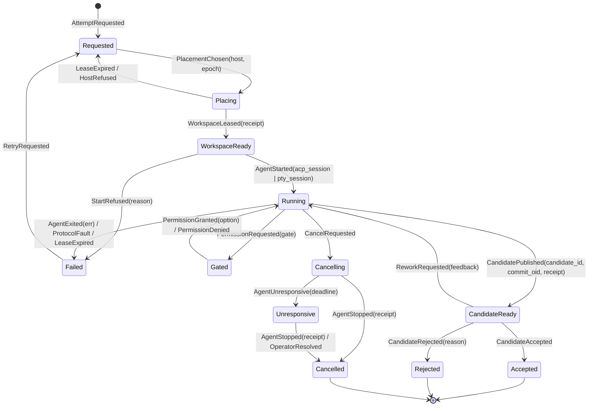

# C4 — Code

C4-level views only for the load-bearing elements — the ones where a wrong
shape is expensive to reverse. Everything else (HTTP handlers, projections,
UI views, jj command strings) is deliberately not specified here; it follows
from these types.

Covered:

1. The attempt aggregate: state machine + Gleam `decide`/`evolve` types
2. The event store: Postgres schema + append contract
3. Host enrollment, keys, and trust profiles
4. The host protocol: commands, epochs, receipts, idempotency
5. The netgw local protocol (BEAM ↔ Rust sidecar)
6. The execution worker: handshake, PTY host, ACP adapter (Rust)
7. Git integration: candidate refs, trunk CAS, conflict-heatmap keys

## 1. Attempt aggregate (Gleam)

The attempt is the busiest aggregate and the template for all others
(task, workspace, host follow the same pattern with smaller alphabets).

### State machine



Every transition is an event; every event carries the receipt or command
that justified it. Two rules with teeth:

- **Retry bumps the lease epoch.** `Failed → Requested` mints
  `epoch + 1`; a new workspace lease is taken and every artifact of the old
  epoch (receipts, refs, worker) is thereafter stale by construction.
  The full fencing token is `(recovery_generation, epoch)`: the recovery
  generation is a control-plane-wide value rotated by the PITR restore
  runbook **before** accepting host traffic, so a database restored to
  before an epoch increment can never re-mint a token a live worker still
  holds. Epochs are nonnegative and capped at `i64::MAX` (Postgres
  `bigint`); Rust and Gleam both reject values above that.
- **Cancellation is honest.** `Cancelling` runs the ladder
  (`session/cancel` → SIGTERM → SIGKILL). If the host cannot prove the
  agent stopped, the attempt parks in `Unresponsive` — an explicit
  uncertain state — instead of pretending it is `Cancelled`.

### Types

```gleam
// ids are opaque, validated once at the boundary
pub type AttemptId { AttemptId(String) }
pub type HostId { HostId(iroh_node_id: String) }
pub type ChangeId { ChangeId(String) } // jj change id — provenance only, never authority
pub type CommitOid { CommitOid(String) } // exact git object id — the review/CAS authority
pub type CandidateId { CandidateId(String) } // minted fresh per publication
pub type LeaseEpoch { LeaseEpoch(Int) } // fencing token, monotone per attempt

pub type AgentChannel {
  Acp(session_id: String, capabilities: AcpCaps)
  Pty(session_seq_start: Int)
}

pub type AttemptState {
  Requested(task: TaskId, spec: AttemptSpec, epoch: LeaseEpoch)
  Placing(host: HostId, epoch: LeaseEpoch, lease_deadline: Timestamp)
  WorkspaceReady(host: HostId, epoch: LeaseEpoch,
                 workspace: WorkspaceId, base: ChangeId)
  Running(host: HostId, epoch: LeaseEpoch,
          workspace: WorkspaceId, channel: AgentChannel)
  Gated(inner: AttemptState, gate: PermissionGate)
  Cancelling(inner: AttemptState, deadline: Timestamp)
  Unresponsive(host: HostId, epoch: LeaseEpoch, since: Timestamp)
  CandidateReady(candidate: CandidateId, oid: CommitOid,
                 epoch: LeaseEpoch, receipt: Receipt)
  Accepted(candidate: CandidateId, oid: CommitOid)
  Rejected(candidate: CandidateId, oid: CommitOid, reason: String)
  Failed(reason: FailReason, epoch: LeaseEpoch)
  Cancelled
}

pub type PermissionGate {
  PermissionGate(
    gate_id: String,
    tool_call: AcpToolCallRef,
    options: List(PermissionOption), // agent-proposed: allow_once, allow_always, ...
    requested_at: Timestamp,
  )
}
```

### The aggregate contract

Same two pure functions for every aggregate; the actor shell is generic.

```gleam
pub type Decision {
  Accept(events: List(AttemptEvent))
  Reject(reason: RejectReason)
}

/// Pure. May reject. Never performs IO.
/// Rejects any receipt whose (host, epoch) ≠ current lease — stale-epoch
/// receipts are the fencing mechanism, enforced here and nowhere else.
pub fn decide(state: AttemptState, cmd: AttemptCommand) -> Decision

/// Pure. Total for all recorded events (replay must never crash) and
/// write-free: replay of an impossible transition returns Quarantined —
/// the *actor shell* records the anomaly event, never evolve itself.
pub fn evolve(state: AttemptState, event: AttemptEvent)
  -> Result(AttemptState, ReplayAnomaly)
```

The actor shell (one per hot aggregate) is the only impure part:

```gleam
// generic over any aggregate A
fn handle(cmd) {
  // command inbox: same command_id → replay recorded outcome, no re-decide.
  // BOTH accepted and rejected outcomes are recorded — a rejection that
  // bypassed the store would make duplicate delivery non-deterministic.
  case inbox.lookup(cmd.command_id) {
    Some(outcome) -> reply(outcome)
    None -> {
      let state = snapshot |> list.fold(tail_events, evolve)
      case decide(state, cmd) {
        Reject(r) ->
          // same transaction shape: inbox record (+ optional audit event,
          // e.g. StaleReceiptRejected), then reply
          case event_store.record_rejection(stream_id, cmd, r) {
            Ok(_) -> reply(Error(r))
          }
        Accept(events) ->
          // one transaction: append all events (contiguous global_seq
          // range) + outbox intents + inbox record, expected-version guarded
          case event_store.append(stream_id, expected_version, events, intents) {
            Ok(v) -> { publish(events); reply(Ok(v)) }
            Error(VersionConflict) -> retry_with_fresh_state(cmd, deadline)
          }
      }
    }
  }
}
```

Concurrent duplicates may both run pure `decide`; the inbox insert makes
exactly **one committed outcome** — the guarantee is one committed effect,
not one `decide` invocation.

Rules the code must keep true:

- **Receipts gate transitions.** `WorkspaceLeased`, `CandidatePublished`,
  `AgentStarted` are only decidable from a signature-verified host receipt
  carrying the current lease epoch.
- **`Gated`/`Cancelling` wrap `Running`** so a gate or cancel cannot lose
  the running context.
- **Host intents ride the same transaction** as events (outbox), so "event
  says start agent, but nobody told the host" is unrepresentable.

## 2. Event store (Postgres)

```sql
create table events (
  global_seq   bigint      not null primary key,  -- commit-ordered, see below
  stream_id    text        not null,   -- "attempt/<id>", "workspace/<id>", ...
  stream_seq   bigint      not null,   -- optimistic concurrency
  event_type   text        not null,   -- "attempt.candidate_published.v1"
  data         jsonb       not null,
  meta         jsonb       not null,   -- command id, actor, causation, receipt sig
  recorded_at  timestamptz not null default now(),
  unique (stream_id, stream_seq)
);

-- single-row counter locked inside the append transaction.
-- An identity/sequence column orders *allocation*, not commit: a slow
-- transaction can commit seq=41 after a reader already saw seq=42, and a
-- checkpointed projection would skip 41 forever. Locking the counter row
-- serializes appends and makes global_seq equal to commit order.
create table event_seq (id bool primary key default true, next bigint not null);

create table command_inbox (
  command_id  uuid primary key,
  stream_id   text not null,
  outcome     jsonb not null,          -- recorded Accept/Reject for replay
  recorded_at timestamptz not null default now()
);

create table snapshots (
  stream_id   text primary key,
  stream_seq  bigint not null,
  schema_ver  int    not null,         -- discard on mismatch, rebuild from log
  checksum    bytea  not null,
  state       jsonb  not null
);

create table outbox (
  id              bigint generated always as identity primary key,
  host_id         text  not null,          -- iroh NodeId
  idempotency_key uuid  not null unique,
  epoch           bigint not null,         -- lease epoch fencing token
  command         jsonb not null,
  created_seq     bigint not null references events (global_seq),
  dispatched_at   timestamptz,
  acked_at        timestamptz
);

create table checkpoints (
  projection  text primary key,
  global_seq  bigint not null
);
```

Append contract (one short transaction, the only write path):

```sql
-- $n = number of events this command emits: one contiguous range per command
update event_seq set next = next + $n returning next;     -- commit-order lock
insert into events (global_seq, stream_id, stream_seq, ...) values (...);  -- ×n
insert into outbox (host_id, idempotency_key, epoch, command, created_seq) ...;
insert into command_inbox (command_id, stream_id, outcome) values (...);
select pg_notify('events', $last_global_seq);
```

Rejected commands run the same transaction minus `events`/`outbox` rows
(plus an audit event when the rejection is itself a fact worth recording,
e.g. `StaleReceiptRejected`).

Versioning policy: event types are suffixed (`.v1`); upcasting happens at
read time in `evolve` decoders; events are never rewritten. Projections
advance write + checkpoint in one transaction; production rebuilds go
through a versioned shadow projection with an atomic swap.

## 3. Host enrollment, keys, trust profiles

```gleam
pub type TrustProfile {
  TrustedHost      // v2 default: agent runs with host-user authority;
                   // receipts prove *host provenance*, not agent innocence
  SandboxedHost    // optional Linux isolation; stronger claims permitted
}

pub type HostEvent {
  HostEnrolled(node_id: String, profile: TrustProfile,
               enrolled_by: OperatorId, token_hash: Bytes)
  HostKeyRotated(old: String, new: String, receipt: Receipt)
  HostRevoked(node_id: String, reason: String)
}
```

Enrollment is a one-time token exchange with **mutual** NodeId pinning:
the host pins the control plane's NodeId, the control plane records the
host's. A reinstalled host is a new identity — there is no key recovery,
only re-enrollment. The signing key lives in hostd, never in workers;
`HostRevoked` invalidates every future receipt from that NodeId at the
verification boundary (netgw).

## 4. Host protocol (irpc over iroh, netgw ↔ hostd)

```rust
/// Control plane → hostd. Every variant carries the outbox idempotency key
/// and the attempt's lease epoch; hostd refuses commands for fenced epochs.
pub enum HostCommand {
    CreateWorkspace { key: Uuid, attempt: AttemptId, epoch: u64,
                      repo: RepoRef, base: ChangeId },
    StartAgent      { key: Uuid, attempt: AttemptId, epoch: u64,
                      harness: HarnessSpec,
                      channel: ChannelPref /* AcpPreferred | PtyOnly */ },
    PromptAgent     { key: Uuid, attempt: AttemptId, epoch: u64,
                      content: Vec<ContentBlock> },
    AnswerPermission{ key: Uuid, attempt: AttemptId, epoch: u64,
                      gate_id: String, outcome: PermissionOutcome },
    StopAgent       { key: Uuid, attempt: AttemptId, epoch: u64, grace: Duration },
    PublishCandidate{ key: Uuid, attempt: AttemptId, epoch: u64, candidate: CandidateId },
    MoveTrunk       { key: Uuid, repo: RepoRef,
                      expect: CommitId, to: CommitId },  // compare-and-swap on git OIDs
    ScanWorkspaces  { key: Uuid },
    ObserveRemoteRefs{ key: Uuid, repo: RepoRef },       // signed ls-remote snapshot
    FenceEpoch      { key: Uuid, attempt: AttemptId, min_valid_epoch: u64 },
    RenewLeases     { key: Uuid },                       // answered by a HostStatus claim
    OpenViewerStream{ attempt: AttemptId, mode: ViewerMode }, // read_only | interactive(grant)
}

/// hostd → control plane. Two distinct signed shapes — not every claim
/// answers a command:
///
/// 1. CommandOutcome: the durable answer to exactly one HostCommand,
///    keyed by its idempotency key; replayed verbatim for duplicates.
/// 2. HostClaim: spontaneous facts (permission requests, agent exits,
///    final outcomes, lease renewals / HostStatus heartbeats, inventory).
///    Keyed by claim_id with optional causation_key when one exists.
pub struct CommandOutcome<T> {
    pub host: NodeId,
    pub key: Uuid,                 // the HostCommand idempotency key
    pub epoch: u64,
    pub body: T,
    pub observed_at: SystemTime,
    pub sig: Signature,            // ed25519 over canonical encoding of the above
}

pub struct HostClaim<T> {
    pub host: NodeId,
    pub claim_id: Uuid,
    pub causation_key: Option<Uuid>,
    pub attempt: Option<AttemptId>,
    pub epoch: u64,
    pub worker_seq: Option<u64>,   // position in the worker's claim spool
    pub body: T,
    pub observed_at: SystemTime,
    pub sig: Signature,
}

/// Telemetry stream frames (lossy-tolerant, never truth)
pub enum TelemetryFrame {
    AcpUpdate { attempt: AttemptId, epoch: u64, update: acp::SessionUpdate, seq: u64 },
    PtyBytes  { attempt: AttemptId, epoch: u64, seq: u64, bytes: Bytes },
    PtySnapshot { attempt: AttemptId, epoch: u64, seq: u64, vt: ScreenSnapshot },
    InventoryObservation { workspace: WorkspaceObservation },
}
```

Delivery semantics: outbox gives at-least-once; hostd's **durable command
journal** (not the advisory manifest) maps `idempotency_key →
received | in_progress | completed(outcome)` and replays the recorded
`CommandOutcome` for a repeated key — effectively-once without distributed
transactions. `in_progress` entries found after a hostd restart trigger
operation-specific reconciliation (e.g. re-check whether the ref exists)
before answering. Stale claims (fenced epoch) are still delivered — the
aggregate rejects them and records the rejection, so late work is visible,
never silently dropped.

## 5. netgw local protocol (BEAM ↔ Rust sidecar)

Gleam never links Rust. The BEAM talks to netgw over a Unix socket with a
length-prefixed CBOR framing, versioned independently of the irpc protocol:

```rust
pub struct NetgwHello { pub proto_versions: Vec<u16> }   // netgw offers
pub struct BeamHello  { pub chosen: u16 }                // BEAM picks one

pub enum BeamToNetgw {
    Dispatch { outbox_id: u64, host: NodeId, key: Uuid, epoch: u64,
               command: HostCommand },
    TrustUpdate { version: u64, enrolled: Vec<NodeId> },  // snapshot after
                                                          // enroll/rotate/revoke
    OpenTelemetry { host: NodeId, attempt: AttemptId },
    Ping,
}

pub enum NetgwToBeam {
    Delivered   { outbox_id: u64 },   // transport-level only → dispatched_at;
                                      // NEVER acks the outbox row
    OutcomeIn   { outcome_cbor: Bytes, verified: bool },  // sig checked in netgw
    ClaimIn     { claim_cbor: Bytes, verified: bool },
    Telemetry   { frame: TelemetryFrame },
    HostDown    { host: NodeId },     // advisory telemetry, never lease truth
    Pong,
}
```

The outbox row's `acked_at` is set only when the BEAM has durably consumed
the corresponding `CommandOutcome` — `Delivered` merely records
`dispatched_at`, so a netgw crash between delivery and outcome loses
nothing. netgw verifies signatures against the latest `TrustUpdate`
snapshot (versioned; the BEAM re-sends on reconnect), so revocation takes
effect at the verification boundary without netgw holding enrollment
authority.

netgw owns: the control-plane NodeId key, iroh endpoint, irpc client pool,
reconnect/backoff, and ed25519 verification against enrolled NodeIds. A
netgw crash drops connections only; the outbox redelivers after restart.
Version negotiation at connect means netgw and BEAM upgrade independently.

## 6. Execution worker (Rust, detached)

One worker process per attempt **epoch**, in its own process group,
surviving hostd restarts. Identity and adoption are explicit:

```rust
/// Written by the worker into its socket path + manifest at startup;
/// verified by hostd on (re)adoption. Epoch mismatch → kill, not adopt.
pub struct WorkerIdentity {
    pub attempt: AttemptId,
    pub epoch: u64,
    pub pid: u32,
    pub started_at: SystemTime,
    pub proto_version: u16,
}

pub enum AdoptOutcome {
    Adopted { identity: WorkerIdentity, resume_from: u64 }, // hostd's ACK cursor
    StaleEpoch { identity: WorkerIdentity },   // fenced → terminate ladder
    HandshakeFailed { socket: PathBuf },       // quarantine + report, never silent kill
}
```

`proto_version` in the handshake is offers/chosen like the netgw hello:
hostd must speak N and N−1 so a hostd upgrade can re-adopt workers started
by the previous version.

Two durable byte streams per worker, deliberately separate:

```rust
/// 1. Claim spool — never dropped. Every state-bearing claim the worker
///    produces gets a monotone worker_seq; hostd signs+forwards and
///    advances an ACK cursor only after the CP durably consumed the claim.
///    On (re)adoption hostd replays the spool from its cursor. Bounded by
///    quota → when full, the worker BLOCKS the agent rather than drop a claim.
pub struct ClaimSpool { next_seq: u64, path: PathBuf }

/// 2. Telemetry journal — bounded, oldest-first eviction, hash-chained
///    segments. Losing old segments is recorded as an explicit
///    RetentionGap, never silent. Fetchable by range for cockpit replay:
pub enum JournalFetch {
    Range { attempt: AttemptId, epoch: u64, from_seq: u64, to_seq: u64 },
}
pub enum JournalFetchResult {
    Segments { segments: Vec<HashChainedSegment> },
    Gap { evicted_through: u64 },              // explicit RetentionGap
}
```

```rust
/// Swappable VT model — vt100 first, alacritty_terminal as the upgrade path.
/// Protocol frames must never expose a crate's cell types.
pub trait TerminalModel: Send {
    fn process(&mut self, bytes: &[u8]);
    fn resize(&mut self, cols: u16, rows: u16);
    fn snapshot(&self) -> ScreenSnapshot;     // self-contained repaint stream
}

/// PTY host: the *rescue shell* in the attempt workspace — not the ACP
/// channel. A piped ACP child can never acquire a PTY later; interactive
/// rescue is always a separate shell beside it.
pub struct PtyHost {
    attempt: AttemptId,
    epoch: u64,
    pty: Box<dyn portable_pty::MasterPty>,
    child: Box<dyn portable_pty::Child>,
    vt: Box<dyn TerminalModel>,
    replay: ReplayBuffer,                     // bounded, seq-numbered raw bytes
    viewers: HashMap<ViewerId, ViewerHandle>, // each with cursor + backpressure
    input_grant: Option<ViewerId>,            // one interactive owner or none
    size_authority: PtySize,                  // single authoritative size
    journal: JournalWriter,                   // append-only, hash-chained
}
// Attach = snapshot(seq=s) then replay.tail_from(s). Zero viewers = no pause.

pub struct AcpAgent {
    attempt: AttemptId,
    epoch: u64,
    child: tokio::process::Child,             // stdio piped, stderr → journal
    conn: acp::Connection,                    // ACP v1 pinned; newline JSON-RPC 2.0
    caps: AcpCaps,                            // negotiated; drives feature gating
    session_id: acp::SessionId,               // persisted in manifest (advisory)
    pending_gates: HashMap<String, oneshot::Sender<PermissionOutcome>>,
    deadlines: DeadlineTable,                 // per-request; miss = protocol fault
}

impl AcpAgent {
    /// stdout: strict JSON-RPC validation — anything else is a ProtocolFault
    ///   claim (agent killed via the ladder), never ignored.
    /// session/update → TelemetryFrame::AcpUpdate (+ journal append). Lossy.
    /// session/request_permission, terminal exit results, final outcomes →
    ///   signed claims via hostd, routed upstream as typed commands. Truth.
    /// fs/read|write → allowed iff path ∈ leased workspace root.
    /// terminal/create.. → ProcessExecutor (retained, hashed output).
    /// cancel ladder: session/cancel → SIGTERM → SIGKILL; if outcome cannot
    ///   be proven, emit AgentUnresponsive — an honest uncertain claim.
    /// on respawn: if caps.load_session, compare the session/load replay
    ///   against our locally retained normalized transcript and report
    ///   match/mismatch — a best-effort continuity check, not a
    ///   cryptographic claim (ACP v1 defines no history hash); without
    ///   load_session, report loss. All ACP capabilities are optional:
    ///   feature gating must handle no-load, no-fs, no-terminal harnesses.
}
```

Workers hold no signing key: they submit claims to hostd over the local
socket; hostd signs after checking the claim's (attempt, epoch) against its
own manifest.

## 7. Git integration: candidate refs, trunk CAS, heatmap keys

```rust
/// Every publication mints a unique CandidateId (rework in the same epoch
/// publishes a NEW candidate; refs are immutable). Refs are namespaced,
/// create-only, candidate-qualified:
///   refs/kanban/candidates/<attempt_id>/<epoch>/<candidate_id>
/// Never force-pushed, never reused. A create push that finds the ref
/// already at the SAME oid is semantic success (idempotent replay); a
/// different oid is a collision → recorded refusal. Refs are deleted only
/// through a typed GC command, and accepted candidates are retained until
/// TrunkMoved (or explicit retirement) — never GC'd on the verdict alone,
/// since the ref may be the only remote pin before trunk lands.
pub struct CandidateRef {
    pub attempt: AttemptId,
    pub epoch: u64,
    pub candidate: CandidateId,
    pub change_id: ChangeId,       // jj change id — metadata only, never authority
    pub commit_id: CommitId,       // pinned git object id at publish time
}

/// Trunk movement is a saga, not a push:
/// 1. read remote trunk oid (git ls-remote)
/// 2. assert oid == expect (CommitId recorded in MoveTrunk)
/// 3. push with an exact lease: --force-with-lease=<full-ref>:<expected-oid>
///    (never the ambient remote-tracking form)
/// 4. outcome carries old oid + new oid
/// Preflight at repo registration: verify push permission and branch
/// protection/rulesets allow the CAS; surface refusal as typed config error.
/// External pushes are *expected*: a failed CAS emits TrunkDiverged and the
/// reconciler replans (rebase candidate, re-review) — never a forced write,
/// never a blind retry. ObserveRemoteRefs additionally snapshots remote refs
/// periodically so external trunk advances are noticed outside sagas too.
pub enum TrunkMoveOutcome {
    Moved { from: CommitId, to: CommitId },
    Diverged { expected: CommitId, actual: CommitId },
}

/// Merge-check inputs are pinned object ids PLUS the engine that computed
/// them — merge results depend on jj/git version and merge configuration,
/// so the key must identify the computation, not just the commits.
pub struct MergeCheckKey {
    pub base_commit: CommitId,            // pinned trunk oid
    pub candidate_commits: Vec<CommitId>, // sorted; len 1 = applicability,
                                          // len 2 = pairwise collision
    pub engine_version: String,           // jj/git versions
    pub merge_config_hash: Bytes,         // attributes/drivers that affect merge
}
// cache: MergeCheckKey → ConflictReport (immutable while the entry exists)
```

Candidate reconstruction on another host asserts the fetched **commit OID**
and resulting tree — never preservation of host-local jj `evolog`, which
does not travel through Git remotes.

Sizing note: these seven sections are the ~20% of the code where invariants
live. The remaining volume (decoders, projections, UI, jj templates) is
mechanical consequence and safe to grow or regenerate.
